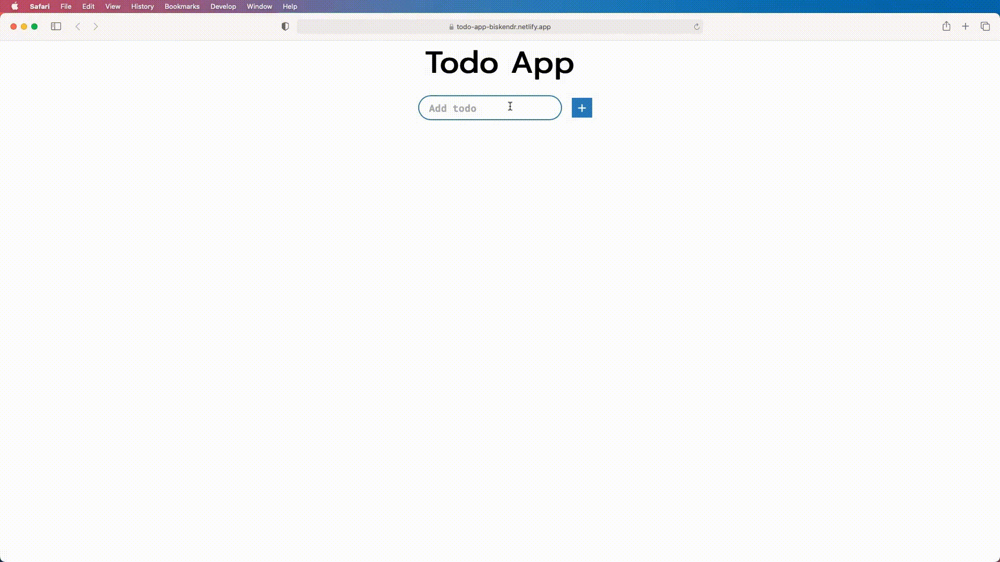

# Todo App
A simple Todo App built using React, Redux and RTK.

## Preview
<hr/>

### [Live Site](https://todo-app-biskendr.netlify.app/)

<br/>



## How to build

<hr/>

1. From the command line, clone the repository.

```sh
$ git clone https://github.com/biskendr/todo-app.git
```
2. Change the directory, then install packages.
```sh
$ cd todo-app
$ npm install
```
3. Once the dependencies are installed,  you can run the app.

```sh
$ npm start
```
4. Open http://localhost:3000 to view it in your browser.
## Built with

<hr/>
 
* [React](https://github.com/facebook/create-react-app)
* [Redux](https://github.com/reduxjs/redux)
* [Redux Toolkit](https://github.com/reduxjs/redux)
* [Nanoid](https://github.com/ai/nanoid)
* [SASS](https://github.com/sass)
* [Font Awesome](https://github.com/FortAwesome/react-fontawesome)


